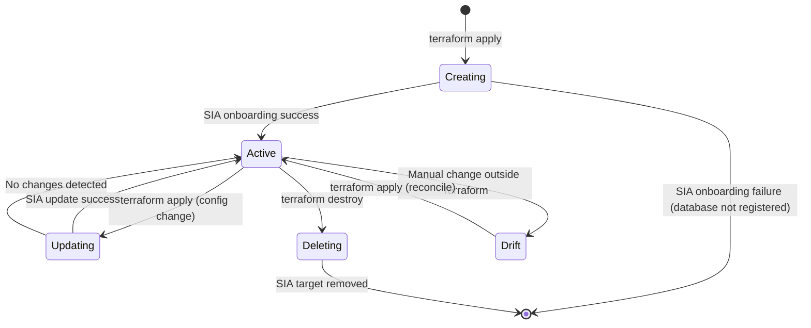
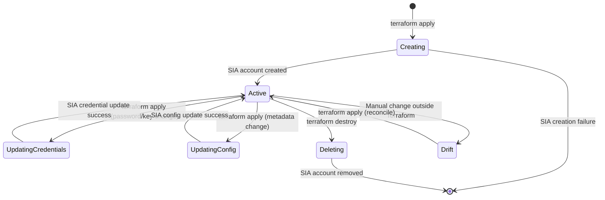

# Data Model: Terraform Provider for CyberArk SIA

**Phase**: 1 - Design & Contracts
**Date**: 2025-10-15
**Status**: Complete

## Overview

This document defines the data entities managed by the Terraform provider, their attributes, relationships, validation rules, and state transitions. Entities map directly to Terraform resources and align with SIA's domain model.

---

## Entity: DatabaseTarget

**Purpose**: Represents an existing database registered with CyberArk SIA for secure access management.

**Terraform Resource**: `cyberark_sia_database_target`

### Attributes

| Attribute | Type | Required | Computed | Sensitive | Description | Validation |
|-----------|------|----------|----------|-----------|-------------|------------|
| `id` | string | No | Yes | No | SIA-assigned unique identifier for the database target | N/A (assigned by SIA) |
| `name` | string | Yes | No | No | User-friendly name for the database target | Length: 1-255 chars, unique within SIA tenant |
| `database_type` | string | Yes | No | No | Type of database system | OneOf: `db2`, `mariadb`, `mongodb`, `mysql`, `oracle`, `postgresql`, `sqlserver` |
| `database_version` | string | Yes | No | No | Database version (semver format) | Min version per database type (see validation rules) |
| `address` | string | Yes | No | No | Hostname, IP address, or FQDN of database | Valid hostname/IP format |
| `port` | number | Yes | No | No | TCP port for database connections | Range: 1-65535 |
| `database_name` | string | No | No | No | Specific database/schema name (optional, database-dependent) | Max 255 chars |
| `authentication_method` | string | Yes | No | No | How SIA authenticates to the database | OneOf: `local`, `domain`, `aws_iam` (depends on database_type) |
| `cloud_provider` | string | No | No | No | Cloud provider hosting the database | OneOf: `aws`, `azure`, `on_premise` (default: `on_premise`) |
| `aws_region` | string | Conditional | No | No | AWS region (required if cloud_provider=aws) | Valid AWS region code |
| `aws_account_id` | string | Conditional | No | No | AWS account ID (required if cloud_provider=aws) | 12-digit number |
| `azure_tenant_id` | string | Conditional | No | No | Azure tenant ID (required if cloud_provider=azure) | Valid UUID |
| `azure_subscription_id` | string | Conditional | No | No | Azure subscription ID (required if cloud_provider=azure) | Valid UUID |
| `description` | string | No | No | No | User-provided description | Max 1024 chars |
| `tags` | map(string) | No | No | No | Key-value metadata tags | Max 50 tags, key/value max 255 chars |
| `last_modified` | string | No | Yes | No | Timestamp of last modification (ISO 8601) | N/A (computed by SIA) |

### Validation Rules

**Provider Validation Scope** (basic input sanitation only):
- `database_type`: Non-empty string (NO enum restriction - user ensures SIA compatibility)
- `database_version`: Non-empty string (NO minimum version checks - user responsibility)
- `port`: Numeric range 1-65535
- `address`: Non-empty string, basic hostname/IP format validation
- `authentication_method`: Non-empty string (NO compatibility checks with database_type)

**SIA API Validation** (performed by SIA, not provider):
- Database type supported by SIA
- Database version meets SIA minimums
- Authentication method compatible with database type
- Cloud provider metadata valid if required

**Cross-Attribute Dependencies** (schema-level, not semantic):
- If `cloud_provider == "aws"`: `aws_region` and `aws_account_id` are required (schema Required)
- If `cloud_provider == "azure"`: `azure_tenant_id` and `azure_subscription_id` are required (schema Required)

**Important**: Provider does NOT validate database compatibility with SIA. If user provides unsupported database type/version/auth method, SIA API will return 400/422 error with specific validation message.

### State Transitions



**State Descriptions**:
- **Creating**: Resource defined in Terraform, pending SIA API call
- **Active**: Resource exists in SIA, state matches Terraform config
- **Updating**: Config changed, pending SIA API update
- **Deleting**: Terraform destroy triggered, pending SIA API delete
- **Drift**: SIA state differs from Terraform state (detected during refresh)

### Relationships

- **One-to-Many** with `StrongAccount`: A database target can have multiple strong accounts
- **Zero-to-Many** with SIA Target Sets (out of scope for this provider)
- **Implicit** with cloud provider resources (AWS RDS, Azure SQL) via Terraform references

---

## Entity: StrongAccount

**Purpose**: Credentials used by SIA to provision ephemeral access to database targets.

**Terraform Resource**: `cyberark_sia_strong_account`

### Attributes

| Attribute | Type | Required | Computed | Sensitive | Description | Validation |
|-----------|------|----------|----------|-----------|-------------|------------|
| `id` | string | No | Yes | No | SIA-assigned unique identifier for the strong account | N/A (assigned by SIA) |
| `name` | string | Yes | No | No | User-friendly name for the strong account | Length: 1-255 chars, unique within SIA tenant |
| `database_target_id` | string | Yes | No | No | ID of the associated database target | Must reference existing database target |
| `authentication_type` | string | Yes | No | No | Type of authentication credentials | OneOf: `local`, `domain`, `aws_iam` (must match target's auth method) |
| `username` | string | Conditional | No | No | Account username (required for local/domain) | Max 255 chars, database-specific naming rules |
| `password` | string | Conditional | No | Yes | Account password (required for local/domain) | Min 8 chars, never logged or output |
| `aws_access_key_id` | string | Conditional | No | Yes | AWS access key (required if authentication_type=aws_iam) | Valid AWS access key format |
| `aws_secret_access_key` | string | Conditional | No | Yes | AWS secret key (required if authentication_type=aws_iam) | Never logged or output |
| `domain` | string | Conditional | No | No | AD domain (required if authentication_type=domain) | Valid domain format (e.g., `corp.example.com`) |
| `description` | string | No | No | No | User-provided description | Max 1024 chars |
| `rotation_enabled` | bool | No | No | No | Whether SIA should rotate credentials | Default: false (manual rotation via Terraform) |
| `rotation_interval_days` | number | Conditional | No | No | Days between rotations (if rotation_enabled=true) | Range: 1-365 |
| `tags` | map(string) | No | No | No | Key-value metadata tags | Max 50 tags, key/value max 255 chars |
| `created_at` | string | No | Yes | No | Timestamp of creation (ISO 8601) | N/A (computed by SIA) |
| `last_modified` | string | No | Yes | No | Timestamp of last modification (ISO 8601) | N/A (computed by SIA) |

### Validation Rules

**Credential Requirements by Type**:
```
local:
  - username: required
  - password: required
  - domain: not allowed
  - aws_*: not allowed

domain:
  - username: required
  - password: required
  - domain: required
  - aws_*: not allowed

aws_iam:
  - username: not allowed
  - password: not allowed
  - domain: not allowed
  - aws_access_key_id: required
  - aws_secret_access_key: required
```

**Cross-Attribute Dependencies**:
- `authentication_type` must match the `authentication_method` of the referenced `database_target_id`
- If `rotation_enabled == true`: `rotation_interval_days` is required

### State Transitions



**Special Considerations**:
- **UpdatingCredentials**: SIA updates credentials immediately; new sessions use new credentials per FR-015a
- **Sensitive Data**: `password`, `aws_secret_access_key` never appear in state files (Terraform handles via drift detection)
- **Rotation**: If `rotation_enabled=true`, SIA may rotate credentials; Terraform will detect drift on next refresh

### Relationships

- **Many-to-One** with `DatabaseTarget`: Each strong account belongs to exactly one database target
- **One-to-Many** with SIA Access Policies (out of scope for this provider)

---

## Entity: Provider Configuration

**Purpose**: Provider-level settings for authenticating to SIA APIs.

**Terraform Block**: `provider "cyberark_sia"`

### Attributes

| Attribute | Type | Required | Sensitive | Description | Validation |
|-----------|------|----------|-----------|-------------|------------|
| `client_id` | string | Yes | Yes | ISPSS service account client ID | Non-empty string |
| `client_secret` | string | Yes | Yes | ISPSS service account client secret | Non-empty string |
| `identity_url` | string | Yes | No | CyberArk Identity tenant URL | Valid HTTPS URL (e.g., `https://example.cyberark.cloud`) |
| `identity_tenant_subdomain` | string | Yes | No | Tenant subdomain for ISPSS | Alphanumeric, 1-63 chars |
| `sia_api_url` | string | No | No | SIA API base URL (if non-standard) | Valid HTTPS URL, defaults to derived from identity_url |
| `max_retries` | number | No | No | Max retry attempts for API calls | Range: 0-10, default: 3 |
| `request_timeout` | number | No | No | API request timeout in seconds | Range: 10-300, default: 30 |

### Example Configuration

```hcl
provider "cyberark_sia" {
  client_id                 = var.cyberark_client_id
  client_secret             = var.cyberark_client_secret
  identity_url              = "https://example.cyberark.cloud"
  identity_tenant_subdomain = "example"
}
```

---

## Validation Summary

### Validator Types

1. **Built-in Framework Validators** (limited scope):
   - `stringvalidator.LengthAtLeast(1)` for non-empty strings
   - `int64validator.Between(1, 65535)` for port range
   - **NO enum validators** for database_type, authentication_method (user responsibility)

2. **Schema-Level Validation** (conditional required fields):
   - Cloud provider conditional attributes (ConditionalRequired based on cloud_provider value)
   - Credential field requirements for strong accounts (ConditionalRequired based on authentication_type)

3. **NO Custom Validators**:
   - ❌ No database version checking
   - ❌ No database type enum validation
   - ❌ No authentication method compatibility checks
   - ❌ No semantic cross-attribute validation

**Validation Philosophy**: Provider performs minimal input sanitation. SIA API is source of truth for semantic validation (database compatibility, version minimums, authentication method support).

---

## State Representation

### Terraform State (Database Target)

```json
{
  "version": 1,
  "resources": [
    {
      "type": "cyberark_sia_database_target",
      "name": "production_postgres",
      "provider": "provider[\"registry.terraform.io/local/cyberark-sia\"]",
      "instances": [
        {
          "schema_version": 0,
          "attributes": {
            "id": "target-uuid-12345",
            "name": "prod-postgres-db",
            "database_type": "postgresql",
            "database_version": "14.2.0",
            "address": "prod-db.example.com",
            "port": 5432,
            "authentication_method": "local",
            "cloud_provider": "aws",
            "aws_region": "us-east-1",
            "aws_account_id": "123456789012",
            "last_modified": "2025-10-15T10:30:00Z"
          }
        }
      ]
    }
  ]
}
```

### Terraform State (Strong Account - Sensitive Data Handling)

```json
{
  "version": 1,
  "resources": [
    {
      "type": "cyberark_sia_strong_account",
      "name": "db_admin",
      "instances": [
        {
          "attributes": {
            "id": "account-uuid-67890",
            "name": "postgres-admin-account",
            "database_target_id": "target-uuid-12345",
            "authentication_type": "local",
            "username": "sia_admin",
            "password": null,
            "rotation_enabled": false,
            "created_at": "2025-10-15T10:35:00Z"
          },
          "sensitive_attributes": [
            [
              {
                "type": "get_attr",
                "value": "password"
              }
            ]
          ]
        }
      ]
    }
  ]
}
```

**Note**: Sensitive attributes (`password`, `aws_secret_access_key`) are marked in Terraform state but encrypted at rest by Terraform. Provider never logs these values.

---

## Data Flow

### Resource Creation Flow

```
Terraform Config → Provider.Configure() → SIAClient initialized
                   ↓
Resource.Create() → Extract config → Validate attributes
                   ↓
SIAClient.CreateDatabaseTarget() → ARK SDK Auth → ISPSS Token
                   ↓
ARK SDK API Call → SIA REST API → Database Target Created
                   ↓
Response → Map to State → Set resource ID → Terraform State Updated
```

### Resource Update Flow

```
Terraform Plan → Detect Diff → Resource.Update()
                   ↓
Extract Plan → Validate changes → Determine update type
                   ↓
(If credentials changed): SIAClient.UpdateCredentials()
(If metadata changed):    SIAClient.UpdateMetadata()
                   ↓
ARK SDK API Call → SIA REST API → Resource Updated
                   ↓
Response → Update State → Terraform State Synced
```

---

## Relationships Diagram

```
┌─────────────────────────────────────┐
│ Provider Configuration              │
│ - client_id                         │
│ - client_secret                     │
│ - identity_url                      │
└────────────┬────────────────────────┘
             │ configures
             ▼
┌─────────────────────────────────────┐
│ SIAClient (internal)                │
│ - ArkISPAuth                        │
│ - Token refresh goroutine           │
│ - UAP API client                    │
└────────────┬────────────────────────┘
             │ used by
             ▼
┌─────────────────────────────────────┐     ┌──────────────────────────────┐
│ DatabaseTarget Resource             │────→│ StrongAccount Resource       │
│ - id (computed)                     │     │ - id (computed)              │
│ - name                              │     │ - database_target_id (FK)    │
│ - database_type                     │     │ - authentication_type        │
│ - address, port                     │     │ - username/password          │
│ - authentication_method             │     │   (sensitive)                │
│ - cloud provider metadata           │     └──────────────────────────────┘
└─────────────────────────────────────┘
             │ references
             ▼
┌─────────────────────────────────────┐
│ External Cloud Resources            │
│ (AWS RDS, Azure SQL)                │
│ Managed by aws/azurerm providers    │
└─────────────────────────────────────┘
```

---

## Conclusion

This data model provides a complete specification for Terraform resources managing SIA database targets and strong accounts. Key design decisions:

1. **Separation of Concerns**: Database targets and strong accounts are separate resources with clear relationships
2. **Validation at Multiple Levels**: Schema-level, custom validators, and cross-attribute checks
3. **Sensitive Data Handling**: Terraform framework's built-in sensitive attribute support
4. **Cloud Agnostic**: Supports AWS, Azure, and on-premise with conditional attributes
5. **State Drift Detection**: Computed attributes for tracking SIA-side changes

**Next Steps**: Generate API contracts in Phase 1 (contracts/ directory).
